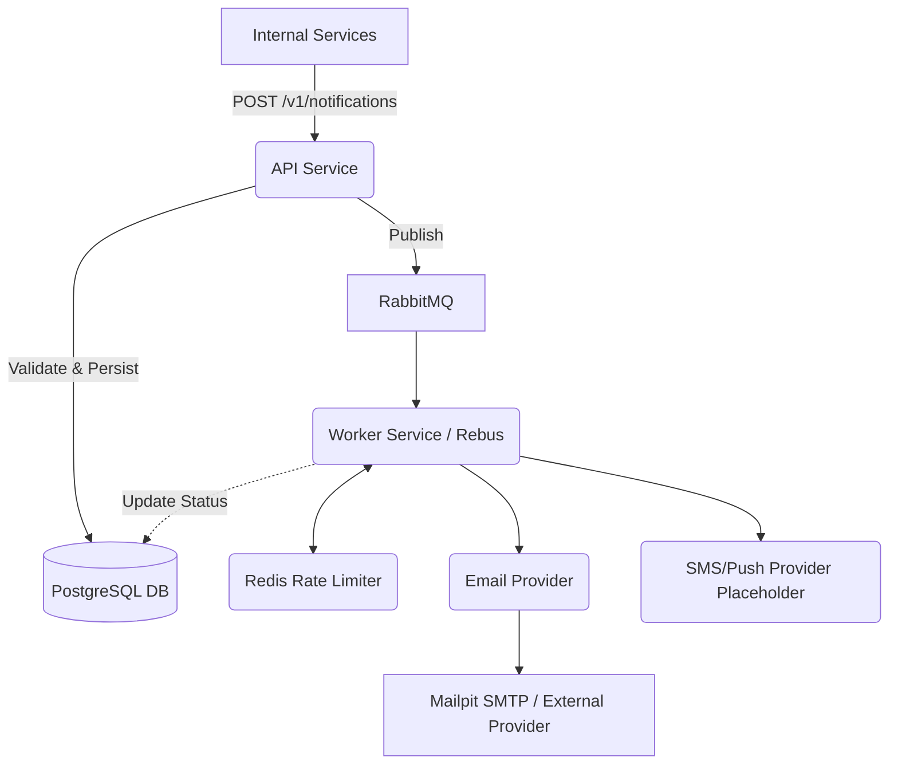

# Architecture Overview

## High-Level Architecture

## Core Components
1. **Notification API (`NotificationService.Api`)**:
   - Ingestion gateway built with Minimal APIs (Clean Code structure). 
   - Validates request (using `JsonStringEnumConverter`), checks idempotency, generates unique ID, saves `Pending` state to Postgres.
   - Pushes message to RabbitMQ using Rebus.
   - Returns `202 Accepted` quickly to unblock the caller.
2. **Worker (`NotificationService.Worker`)**:
   - Consumes messages asynchronously from RabbitMQ via Rebus.
   - Applies Redis-backed Rate Limiting per user/channel.
   - Dispatches message to specific providers (e.g., `SmtpEmailProvider`).
   - Uses `NotificationDbContext` to query PostgreSQL and update the notification lifecycle status (`Sent`, `Failed`) upon completion.
3. **Database (PostgreSQL)**: Stores the metadata, payload, and state lifecycle of notifications.
4. **Message Broker (RabbitMQ)**: Provides durable, decoupled queues for asynchronous processing.
5. **Rate Limiting Cache (Redis)**: Tracks notification counts per time window to prevent spam.
