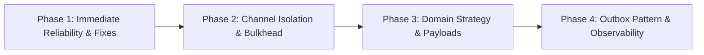

# Notification Service: Architecture Concerns & Improvement Plan

> **Document Status:** Proposed Plan  
> **Target Date:** Q4 2026  
> **Scope:** High Availability, Fault Isolation, Resiliency, Clean Architecture & Observability

---

## 1. Executive Summary & Problem Statement

The Notification Service currently provides basic asynchronous ingestion and email delivery via RabbitMQ, PostgreSQL, Redis, and Rebus. However, an architectural review revealed several critical distributed system vulnerabilities, single points of failure, and code hygiene gaps that threaten system availability under production loads.

Most notably, all notification channels share a single queue and worker pool, meaning **an outage in a downstream SMS provider will stall the entire notification system**, starving email and push notifications. Additionally, dual-write inconsistencies, non-atomic rate limiting, and unhandled idempotency conflicts present serious reliability risks.

---

## 2. Comprehensive Inventory of Concerns

### A. Distributed Systems & High Availability Concerns

| ID | Concern | Severity | Location | Impact |
| :--- | :--- | :--- | :--- | :--- |
| **A1** | **Shared Queue Head-of-Line Blocking** | **Critical** | `Api/Program.cs`, `Worker/Program.cs` | All channels share `notification_worker_queue`. A dead or hanging SMS provider consumes all worker threads; healthy emails and pushes are starved. |
| **A2** | **Dual-Write Inconsistency (No Outbox)** | **High** | `NotificationEndpoints.cs:L37-L50` | Synchronous write to PostgreSQL, followed by publish to RabbitMQ, followed by another write to PostgreSQL. If RabbitMQ is down, messages stay `Pending` in DB forever. |
| **A3** | **Idempotency Exception Returns HTTP 500** | **High** | `NotificationEndpoints.cs:L37-L39` | Duplicate requests violate the unique index on `IdempotencyKey`. EF Core throws `DbUpdateException` unhandled, returning 500 to callers instead of idempotent 200/202/409. |
| **A4** | **Schema Discrepancy on Idempotency** | **Medium** | `NotificationDbContext.cs:L27-L28` vs `DESIGN.md:L4` | `DESIGN.md` specifies composite unique index `(IdempotencyKey, UserId)`, but DB model only indexes `IdempotencyKey`. |
| **A5** | **Redis Rate Limiter TTL Leak (Non-Atomic)** | **High** | `RedisRateLimiter.cs:L20-L26` | `INCR` and `EXPIRE` are executed separately. If the process terminates between calls, the key has no TTL and remains blocked forever. |
| **A6** | **Status Mutation Conflicts with Retries** | **Medium** | `NotificationHandler.cs:L57-L62` | Transient failures immediately mark DB status as `Failed` before rethrowing to Rebus. If a subsequent retry succeeds, status flips to `Sent`, causing false-negative reporting. |
| **A7** | **Missing Message TTL & Expiration Handling** | **Medium** | `NotificationEndpoints.cs`, RabbitMQ | Time-sensitive messages (e.g., 2FA OTP codes) have no TTL. During worker backlogs, outdated OTPs get delivered late, causing bad UX and security risks. |

### B. Domain Modeling & Extensibility Concerns

| ID | Concern | Severity | Location | Impact |
| :--- | :--- | :--- | :--- | :--- |
| **B1** | **Open/Closed Principle Violation in Dispatcher** | **High** | `NotificationHandler.cs:L43-L55` | Hardcoded `if/else` checks for `NotificationChannel`. Adding SMS or Push requires editing the consumer directly. |
| **B2** | **Inadequate Destination & Payload Modeling** | **High** | `SendNotificationCommand.cs`, `CreateNotificationRequest.cs` | Destination email is hardcoded (`{userId}@example.com`). No fields for email subjects, SMS phone numbers, or push device tokens. |
| **B3** | **Missing Notification Status Query Endpoint** | **Medium** | `NotificationEndpoints.cs` | API returns `202 Accepted` with a location header `/v1/notifications/{id}`, but no `GET` endpoint exists to query delivery status. |

### C. Code Hygiene, Validation & Observability Concerns

| ID | Concern | Severity | Location | Impact |
| :--- | :--- | :--- | :--- | :--- |
| **C1** | **Dead Code: Unregistered BackgroundService** | **Low** | `Worker.cs` in `Worker` | Template code that logs timestamps every second, never registered in DI. |
| **C2** | **Dead Code: Empty Class1** | **Low** | `Class1.cs` in `Infrastructure` | Leftover boilerplate from `dotnet new classlib`. |
| **C3** | **Unused Package Reference** | **Low** | `Infrastructure.csproj:L9` | References `MassTransit.RabbitMQ` while the project uses `Rebus`. |
| **C4** | **Missing Health Checks** | **Medium** | `Api/Program.cs`, `Worker/Program.cs`, `docker-compose.yml` | No `/healthz` or `/ready` endpoints to monitor PostgreSQL, RabbitMQ, or Redis health. |
| **C5** | **Missing Input Validation** | **Medium** | `NotificationEndpoints.cs` | No validation for empty payloads, missing `UserId`, or invalid enum values. |

---

## 3. Phased Implementation Plan



---

### Phase 1: Immediate Reliability & Quick Wins (Sprint 1)
**Goal:** Eliminate unhandled 500 errors, fix data leaks, and clean dead dependencies.

1. **Fix Idempotency Error Handling & Composite Index:**
   - In `NotificationDbContext.cs`, update index to composite:
     ```csharp
     entity.HasIndex(e => new { e.IdempotencyKey, e.UserId }).IsUnique();
     ```
   - In `NotificationEndpoints.cs`, catch `DbUpdateException` (or query existing records) and return `200 OK` / `409 Conflict` with the existing notification details.
2. **Make Redis Rate Limiter Atomic:**
   - Replace sequential `INCR` + `EXPIRE` with an atomic Lua script in `RedisRateLimiter.cs`:
     ```lua
     local current = redis.call('INCR', KEYS[1])
     if current == 1 then
         redis.call('EXPIRE', KEYS[1], ARGV[1])
     end
     return current
     ```
3. **Repository Clean-up:**
   - Delete `NotificationService.Worker/Worker.cs` and `NotificationService.Infrastructure/Class1.cs`.
   - Remove `<PackageReference Include="MassTransit.RabbitMQ" />` from `NotificationService.Infrastructure.csproj`.

---

### Phase 2: Channel Isolation & Message Lifecycles (Sprint 2)
**Goal:** Prevent SMS/push outages from taking down the entire notification system.

1. **Queue Isolation (Bulkhead Pattern):**
   - Split queues into channel-specific queues:
     - `notification_email_queue`
     - `notification_sms_queue`
     - `notification_push_queue`
   - Map Rebus routing in API based on channel:
     ```csharp
     r.TypeBased()
      .Map<SendEmailCommand>("notification_email_queue")
      .Map<SendSmsCommand>("notification_sms_queue")
      .Map<SendPushCommand>("notification_push_queue");
     ```
2. **Configurable Message TTL:**
   - Add `TimeToBeReceived` header to `bus.Send(...)` for time-sensitive notifications (e.g., OTP SMS: 3-5 min TTL, Marketing: 24h TTL).
   - Configure RabbitMQ Dead-Letter Exchange (`x-dead-letter-exchange`) to capture expired messages in `notification_dlq`.
3. **Rebus Retry & DLQ Alignment:**
   - Configure explicit error queue naming (`notification_error_queue`).
   - Implement `IHandleMessages<IFailed<T>>` to only mark notifications as `Failed` in DB when retries are completely exhausted, rather than on transient initial errors.

---

### Phase 3: Domain Extensibility & Rich Payloads (Sprint 3)
**Goal:** Clean architecture, strategy pattern for providers, and client transparency.

1. **Channel Provider Strategy Pattern:**
   - Define provider interface in Core:
     ```csharp
     public interface INotificationChannelProvider
     {
         NotificationChannel Channel { get; }
         Task<ProviderResult> SendAsync(SendNotificationCommand command, CancellationToken ct);
     }
     ```
   - Implement `SmtpEmailProvider`, `TwilioSmsProvider`, and `FcmPushProvider`.
   - Consumer delegates to the matching provider strategy via DI registry.
2. **Rich Recipient & Payload Metadata:**
   - Extend `NotificationRecord` and `SendNotificationCommand` to support:
     - `Recipient`: (e.g., email address, phone number, device token)
     - `Subject`: (for emails/push titles)
     - `Metadata`: Key-value pairs for template parameters.
3. **Status Query Endpoint:**
   - Implement `GET /v1/notifications/{id}` returning current status, timestamps, and provider delivery summary.

---

### Phase 4: Enterprise Outbox Pattern & Production Observability (Sprint 4)
**Goal:** Zero message loss guarantee and production monitoring.

1. **Transactional Outbox Pattern:**
   - Store outgoing messages in an `OutboxMessages` table within the same DB transaction as `Notifications`.
   - Use a background worker (or Rebus Outbox / CDC) to read and publish outbox records to RabbitMQ reliably.
2. **ASP.NET Core Health Checks:**
   - Register `AddHealthChecks()` in API and Worker checking PostgreSQL, RabbitMQ, and Redis.
   - Expose `/health/live` and `/health/ready` endpoints.
   - Add Docker Compose container `healthcheck` directives.
3. **OpenTelemetry & Distributed Tracing:**
   - Propagate W3C Trace Context across HTTP ingestion -> RabbitMQ message headers -> Worker consumer execution.

---

## 4. Acceptance Criteria & Success Metrics

- **Zero Head-of-Line Blocking:** If the SMS provider mock returns 500 or times out, Email delivery latency remains `< 500ms`.
- **Idempotency Stability:** Sending 10 identical requests simultaneously produces exactly 1 queued message and 9 successful responses without 500 errors.
- **Zero Redis TTL Leaks:** 100% of rate-limited Redis keys possess a valid TTL verified via Redis `TTL` command.
- **Full Traceability:** Every notification can be queried by ID from `POST /v1/notifications` through `GET /v1/notifications/{id}`.
